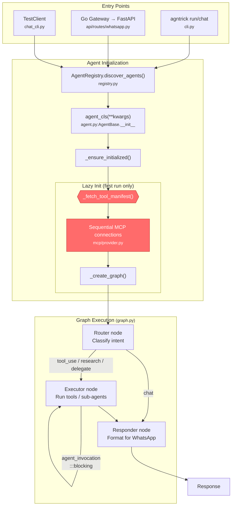
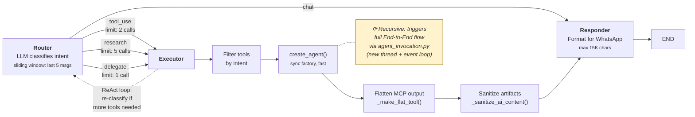

# Agntrick — Agent Framework

**FOR LLM AGENTS DEVELOPING THIS FRAMEWORK.** Read this before making any changes.

---

## Quick Verification

After **every** code change, run from project root:

```bash
make check && make test
```

Do not claim done until both pass. Fix all lint errors and test failures first.

---

## Working with agntrick-toolkit (MCP Toolbox)

Agntrick works best paired with **[agntrick-toolkit](https://github.com/jeancsil/agntrick-toolbox)** — a Docker-based MCP server providing 12+ curated CLI tools (pdf, pandoc, jq, ffmpeg, ripgrep, git, etc.).

**Setup is two steps:**

```bash
# 1. Start the toolkit (one command)
cd /path/to/agntrick-toolbox && docker-compose up -d

# 2. Tell agntrick where it is
export AGNTRICK_TOOLKIT_PATH=/path/to/agntrick-toolbox
```

That's it. The `chat` CLI and `serve` command auto-discover the toolkit via `AGNTRICK_TOOLKIT_PATH` and start the MCP subprocess. The `assistant` agent registers `toolbox` as its MCP server and gets access to all toolkit tools automatically.

**Verify it's working:**

```bash
curl http://localhost:8080/health   # Should return "OK"
agntrick chat "Summarize this PDF: ./report.pdf"
```

When `AGNTRICK_TOOLKIT_PATH` is unset or the path doesn't exist, agntrick still works — agents just won't have toolbox tools available.

---

## Commands Reference

```bash
make check          # mypy + ruff (linting)
make test           # pytest with coverage
make format         # auto-format with ruff
make install        # install dependencies (uv sync)
make clean          # remove caches and artifacts

# CLI
agntrick list                              # list registered agents
agntrick info developer                    # show agent details
agntrick developer -i "input"              # run agent directly
agntrick chat "hello"                      # local chat via test pipeline
agntrick chat "hello" -a assistant         # chat with specific agent
agntrick chat "hello" -v                   # verbose (debug logging)
agntrick serve                             # start FastAPI server (WhatsApp)

# Docker
make docker-build
docker compose run --rm app make test
bin/agent.sh developer -i "input"

# Go gateway
cd gateway && go test ./...
cd gateway && go fmt ./...
cd gateway && go vet ./...
make gateway-build
make gateway-test
```

---

## Package Manager

**Use `uv` exclusively.** Never use pip, poetry, pipenv, or pip-tools.

```bash
uv add package-name           # add dependency
uv add --dev package-name     # add dev dependency
uv sync                       # install all dependencies
uv run <command>              # run in venv
```

---

## Project Structure

```
src/agntrick/
├── agent.py              # AgentBase — shared base class for all agents
├── graph.py              # 3-node StateGraph (Router → Executor → Responder)
├── chat_cli.py           # Local chat CLI with MCP subprocess management
├── cli.py                # Typer CLI entry point (list, info, run, chat, serve)
├── config.py             # YAML config loading + AgntrickConfig model
├── constants.py          # BASE_DIR, LOGS_DIR, timeouts
├── registry.py           # Agent discovery and @AgentRegistry.register decorator
├── exceptions.py         # Custom exceptions
├── logging_config.py     # Logging setup
├── agents/               # Agent implementations
│   ├── assistant.py      # Default generalist (orchestrates tools + agents)
│   ├── developer.py      # Code exploration and development
│   ├── committer.py      # Git commit automation
│   ├── learning.py       # Educational content
│   ├── news.py           # News aggregation
│   ├── ollama.py         # Ollama-backed agent
│   ├── youtube.py        # YouTube transcript extraction
│   └── github_pr_reviewer.py  # PR review automation
├── tools/                # Tool implementations
│   ├── agent_invocation.py   # Invoke other agents from within an agent
│   ├── manifest.py           # Tool manifest client with circuit breaker
│   ├── codebase_explorer.py  # Code navigation (AST-based)
│   ├── code_searcher.py      # ripgrep wrapper
│   ├── syntax_validator.py   # Tree-sitter validation
│   ├── git_command.py        # Git operations
│   ├── youtube_transcript.py # YouTube transcript fetcher
│   ├── youtube_cache.py      # Transcript cache
│   └── example.py            # Tool template
├── prompts/              # System prompts (loaded from .md files)
│   ├── assistant.md
│   ├── developer.md
│   ├── committer.md
│   ├── learning.md
│   ├── news.md
│   ├── ollama.md
│   ├── youtube.md
│   ├── github_pr_reviewer.md
│   ├── generator.py       # Prompt generation utilities
│   ├── loader.py          # Prompt loading from .md files
│   └── templates/         # Jinja prompt templates
├── api/                  # FastAPI multi-tenant server
│   ├── server.py         # App factory (create_app)
│   ├── routes/           # Route handlers (WhatsApp webhook, health)
│   ├── middleware/        # Logging, error handling, auth
│   ├── models/           # Pydantic request/response models
│   └── database/         # DB connection and sessions
├── whatsapp/             # WhatsApp integration
│   ├── tenant_registry.py     # Phone-to-tenant registry
│   ├── webhook.py             # WhatsApp webhook handlers
│   └── session_manager.py     # Session management
├── mcp/                  # MCP integration
│   ├── config.py         # MCP server configurations
│   └── provider.py       # MCP connection management
├── services/             # Shared services
│   ├── audio_transcriber.py      # Groq-based audio transcription
│   └── audio_transcription_cache.py  # Transcription cache
├── storage/              # Persistence layer
│   ├── database.py       # SQLite database setup
│   ├── models.py         # ORM models
│   ├── scheduler.py      # Scheduled tasks
│   ├── tenant_manager.py # Tenant CRUD
│   └── repositories/     # Repository pattern implementations
├── llm/                  # LLM provider abstraction
│   ├── providers.py      # OpenAI, Anthropic, Ollama providers
│   └── local_reasoning.py # Local model reasoning
├── interfaces/           # Abstract base classes
│   └── base.py           # Agent and Tool ABCs
└── cron/                 # Scheduled tasks

gateway/                  # Go WhatsApp gateway
├── main.go               # Entry point
├── config.go             # YAML config parsing
├── session.go            # WhatsApp session manager
├── message.go            # Message handling + self-message detection
├── http_client.go        # HTTP client for Python API
├── qr.go                 # QR code generation
└── go.mod

tests/                    # Test suite
├── test_graph.py         # Graph routing/intent tests
├── test_chat_cli.py      # Chat CLI + MCP manager tests
├── test_agent_invocation.py
├── test_api/             # API route tests
├── test_mcp/             # MCP provider tests
├── test_tools/           # Tool tests
├── test_prompts/         # Prompt loading tests
└── ...                   # Per-module test files
```

---

## Execution Flow

### End-to-End Pipeline



### Graph Detail (3-Node StateGraph)



### Blocking Calls

| Location | Pattern | Impact | Intentional? |
|---|---|---|---|
| `tools/agent_invocation.py:136-138` | `thread.join()` + new event loop | Blocks up to 65s on delegation | Necessary — each delegated agent needs isolated loop |
| `mcp/provider.py:122-127` | Sequential `await stack.enter_async_context()` | N × 60s startup delay | Yes — avoids anyio "different task" cleanup bugs |
| `graph.py:434` | `create_agent()` sync factory | Negligible (in-memory) | Yes |
| `agent.py:266-294` | `_fetch_tool_manifest()` HTTP | 5s+ if toolbox slow | Circuit breaker + 5m cache mitigates |

### Agent Registration

```python
@AgentRegistry.register("agent-name", mcp_servers=["toolbox"], tool_categories=["web"])
class MyAgent(AgentBase):
    @property
    def system_prompt(self) -> str:
        return load_prompt("agent-name")  # loads from prompts/agent-name.md

    def local_tools(self) -> Sequence[Any]:
        return [...]  # optional local tools
```

### Tool Manifest

`tools/manifest.py` discovers available tools from the toolbox MCP server with a circuit breaker for resilience. The `assistant` agent uses `tool_categories` to filter which toolbox tools it accesses.

### MCP Server Manager

`chat_cli.py:MCPServerManager` handles the agntrick-toolkit subprocess lifecycle. Set `AGNTRICK_TOOLKIT_PATH` to auto-start the toolkit when using `agntrick chat` or `agntrick serve`.

---

## Code Standards

- **Type hints required** — strict mypy. All functions must have type hints.
- **Google-style docstrings** — for all public functions.
- **Async everywhere** — agent `run()` methods are async. Never call blocking sync code in async context.
- **Tools return error strings** — never raise exceptions from tools. Return `"Error: ..."` strings.
- **Error handling** — use try/except in tools, return user-friendly error strings.
- **Docker preferred** — avoid installing dependencies locally when Docker works.

---

## Testing

Tests in `tests/`. Minimum coverage: 60%. Current: ~80%.

```bash
make test                       # run all tests
uv run pytest tests/test_graph.py  # run specific file
```

**Naming:** `test_<module>.py` files, `test_<function>_<scenario>()` functions.

**Mocking:** Use `monkeypatch` for external dependencies. Use `TestClient` for API routes.

---

## Common Tasks

### Adding a New Agent

1. Create `src/agntrick/agents/my_agent.py`
2. Subclass `AgentBase`, add `@AgentRegistry.register()` decorator
3. Define `system_prompt` property (load from `prompts/my_agent.md`)
4. Override `local_tools()` if needed
5. Add tests in `tests/test_my_agent.py`
6. Run `make check && make test`

### Adding a New Tool

1. Create `src/agntrick/tools/my_tool.py`
2. Subclass `Tool` from `interfaces.base`
3. Implement `name`, `description`, `invoke()`
4. Export from `tools/__init__.py`
5. Add tests in `tests/test_my_tool.py`
6. Run `make check && make test`

### Fixing a Bug

1. Write a failing test that reproduces the bug
2. Run `make test` to confirm failure
3. Fix the code
4. Run `make check && make test`

---

## Behavioral Rules

- **Always** run `make check && make test` after changes
- **Never** commit unless explicitly requested
- **Never** push without confirmation
- **Never** introduce dependencies without discussion
- **Never** use pip/poetry/pipenv — only `uv`
- **Before** adding features, check if similar functionality exists
- **Before** refactoring, ensure tests cover affected code

---

## Environment

Copy `.env.example` to `.env` and fill in:

- `OPENAI_API_KEY` or `ANTHROPIC_API_KEY` (required)
- `OPENAI_BASE_URL` (optional — for OpenRouter, Ollama, LM Studio, z.ai)
- `OPENAI_MODEL_NAME` / `ANTHROPIC_MODEL_NAME` (optional)
- `AGNTRICK_TOOLKIT_PATH` (optional — path to agntrick-toolbox for MCP tools)
- `GITHUB_TOKEN` (optional — for PR reviewer agent)
- `GROQ_AUDIO_API_KEY` (optional — for audio transcription)

---

## Git Hooks

Pre-push hook runs `make check`. If it fails, fix errors and try again.

---

## Keeping README.md in Sync

Update README.md when you add/remove agents, tools, MCP servers, or change the public API.
