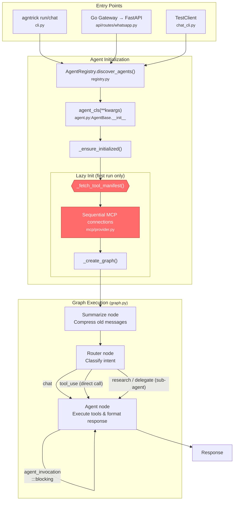
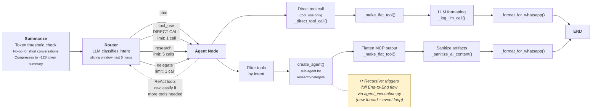

# Agntrick — Agent Framework

**FOR LLM AGENTS DEVELOPING THIS FRAMEWORK.** Read this before making any changes.

---

## Quick Verification

After **every** code change, run from project root:

```bash
make check && make test
```

Do not claim done until both pass. Fix all lint errors and test failures first.

---

## Deployment

This project runs on bare-metal Digital Ocean Ubuntu droplets. Do NOT suggest Docker-based deployment. Always target the droplet environment directly (systemd services, Go binary builds, Python venvs). Use the `/deploy-do` skill to deploy branches to the droplet.

---

## Verification

After making code changes that fix bugs, always verify the fix against the actual runtime before declaring it complete. What "actual runtime" means depends on what changed:

- **Agent/graph changes:** `agntrick chat "test prompt" -a <agent>`
- **API/server changes:** `agntrick serve` then `curl http://localhost:8000/health`
- **Tool changes:** `agntrick chat` with a prompt that exercises the tool
- **Config/prompt changes:** `agntrick list` + `agntrick chat` to verify loading

Running `make check && make test` is necessary but not sufficient — it does not exercise real prompt loading, tool registration, or agent instantiation.

---

## Working with agntrick-toolkit (MCP Toolbox)

Agntrick works best paired with **[agntrick-toolkit](https://github.com/jeancsil/agntrick-toolbox)** — a Docker-based MCP server providing 12+ curated CLI tools (pdf, pandoc, jq, ffmpeg, ripgrep, git, etc.).

**Setup is two steps:**

```bash
# 1. Start the toolkit (one command)
cd /path/to/agntrick-toolkit && docker-compose up -d

# 2. Tell agntrick where it is — add to .env
echo 'AGNTRICK_TOOLKIT_PATH=/path/to/agntrick-toolkit' >> .env
```

That's it. The `chat` CLI and `serve` command auto-discover the toolkit via `AGNTRICK_TOOLKIT_PATH` (loaded from `.env`) and start the MCP subprocess. The `assistant` agent registers `toolbox` as its MCP server and gets access to all toolkit tools automatically.

**Verify it's working:**

```bash
curl http://localhost:8080/health   # Should return "OK"
agntrick chat "Summarize this PDF: ./report.pdf"
```

When `AGNTRICK_TOOLKIT_PATH` is unset or the path doesn't exist, agntrick still works — agents just won't have toolbox tools available.

---

## Commands Reference

```bash
make check          # mypy + ruff (linting)
make test           # pytest with coverage
make format         # auto-format with ruff
make install        # install dependencies (uv sync)
make clean          # remove caches and artifacts
make build          # build wheel and sdist
make release VERSION=1.0.0  # tag and release package

# CLI
agntrick list                              # list registered agents
agntrick info developer                    # show agent details
agntrick developer -i "input"              # run agent directly
agntrick chat "hello"                      # local chat via test pipeline
agntrick chat "hello" -a assistant         # chat with specific agent
agntrick chat "hello" -v                   # verbose (debug logging)
agntrick serve                             # start FastAPI server (WhatsApp)

# Docker
make docker-build
docker compose run --rm app make test
bin/agent.sh developer -i "input"

# Go gateway
cd gateway && go test ./...
cd gateway && go fmt ./...
cd gateway && go vet ./...
make gateway-build
make gateway-test

# DO deployment (run on droplet)
make deploy-do         # full deploy: build + restart + toolbox
make deploy-do-logs    # tail service logs
make deploy-do-stop    # stop all services
```

---

## Package Manager

**Use `uv` exclusively.** Never use pip, poetry, pipenv, or pip-tools.

```bash
uv add package-name           # add dependency
uv add --dev package-name     # add dev dependency
uv sync                       # install all dependencies
uv run <command>              # run in venv
```

---

## Project Structure

```
src/agntrick/
├── agent.py              # AgentBase — shared base class for all agents
├── graph.py              # 3-node StateGraph (Summarize → Router → Agent)
├── chat_cli.py           # Local chat CLI with MCP subprocess management
├── cli.py                # Typer CLI entry point (list, info, run, chat, serve)
├── cli_init.py           # `agntrick init` command — project scaffolding
├── config.py             # YAML config loading + AgntrickConfig model
├── constants.py          # BASE_DIR, LOGS_DIR, timeouts
├── registry.py           # Agent discovery and @AgentRegistry.register decorator
├── exceptions.py         # Custom exceptions
├── logging_config.py     # Logging setup
├── timing.py             # Performance timing utilities
├── agents/               # Agent implementations
│   ├── assistant.py      # Default generalist (orchestrates tools + agents)
│   ├── developer.py      # Code exploration and development
│   ├── committer.py      # Git commit automation
│   ├── learning.py       # Educational content
│   ├── news.py           # News aggregation
│   ├── br_news.py        # Brazilian Portuguese news
│   ├── es_news.py        # Spanish news
│   ├── ollama.py         # Ollama-backed agent
│   ├── youtube.py        # YouTube transcript extraction
│   ├── github_pr_reviewer.py  # PR review automation
│   └── paywall_remover.py     # Paywall bypass agent
├── tools/                # Tool implementations
│   ├── agent_invocation.py   # Invoke other agents from within an agent
│   ├── manifest.py           # Tool manifest client with circuit breaker
│   ├── codebase_explorer.py  # Code navigation (AST-based)
│   ├── code_searcher.py      # ripgrep wrapper
│   ├── syntax_validator.py   # Tree-sitter validation
│   ├── git_command.py        # Git operations
│   ├── youtube_transcript.py # YouTube transcript fetcher
│   ├── youtube_cache.py      # Transcript cache
│   ├── deep_scrape.py        # Deep web page scraping with Playwright
│   └── example.py            # Tool template
├── prompts/              # System prompts (loaded from .md files)
│   ├── assistant.md
│   ├── developer.md
│   ├── committer.md
│   ├── learning.md
│   ├── news.md
│   ├── br-news.md
│   ├── es-news.md
│   ├── ollama.md
│   ├── youtube.md
│   ├── github_pr_reviewer.md
│   ├── paywall_remover.md
│   ├── generator.py       # Prompt generation utilities
│   └── loader.py          # Prompt loading from .md files
├── api/                  # FastAPI multi-tenant server
│   ├── server.py         # App factory (create_app)
│   ├── pool.py           # TenantAgentPool — per-tenant agent instances with LRU eviction
│   ├── routes/           # Route handlers (WhatsApp webhook, health, agents)
│   ├── middleware.py      # Logging, error handling
│   ├── auth.py           # API key authentication
│   ├── deps.py           # FastAPI dependency injection
│   ├── resilience.py     # Retry and circuit breaker for API calls
│   └── security.py       # Input validation and sanitization
├── whatsapp/             # WhatsApp integration
│   └── registry.py            # Phone-to-tenant registry
├── mcp/                  # MCP integration
│   ├── config.py         # MCP server configurations
│   ├── provider.py       # MCP connection management
│   └── interceptors.py   # MCP request/response interceptors
├── services/             # Shared services
│   ├── audio_transcriber.py      # Groq-based audio transcription
│   └── audio_transcription_cache.py  # Transcription cache
├── storage/              # Persistence layer
│   ├── database.py       # SQLite database setup
│   ├── models.py         # ORM models
│   ├── scheduler.py      # Scheduled tasks
│   ├── tenant_manager.py # Tenant CRUD
│   └── repositories/     # Repository pattern implementations
├── llm/                  # LLM provider abstraction
│   ├── providers.py      # OpenAI, Anthropic, Ollama providers
│   └── local_reasoning.py # Local model reasoning
├── interfaces/           # Abstract base classes
│   └── base.py           # Agent and Tool ABCs
└── cron/                 # Scheduled tasks

gateway/                  # Go WhatsApp gateway
├── main.go               # Entry point
├── config.go             # YAML config parsing
├── session.go            # WhatsApp session manager
├── message.go            # Message handling + self-message detection
├── http_client.go        # HTTP client for Python API
├── qr.go                 # QR code generation
├── config_test.go        # Config parsing tests
├── message_test.go       # Message handling tests
├── session_test.go       # Session tests
└── go.mod

tests/                    # Test suite
├── test_graph.py         # Graph routing/intent tests
├── test_agent.py         # Agent base class tests
├── test_chat_cli.py      # Chat CLI + MCP manager tests
├── test_agent_invocation.py
├── test_cli.py           # CLI command tests
├── test_cli_init.py      # `agntrick init` tests
├── test_config.py        # Config loading tests
├── test_pool.py          # Tenant agent pool tests
├── test_timing.py        # Timing utilities tests
├── test_api/             # API route tests
├── test_mcp/             # MCP provider tests
├── test_tools/           # Tool tests
├── test_prompts/         # Prompt loading tests
├── test_integration/     # End-to-end integration tests
├── test_storage/         # Storage layer tests
└── ...                   # Per-module test files
```

---

## Execution Flow

### End-to-End Pipeline



### Graph Detail (3-Node StateGraph: Summarize → Router → Agent)



### Blocking Calls

| Location | Pattern | Impact | Intentional? |
|---|---|---|---|
| `tools/agent_invocation.py:136-138` | `thread.join()` + new event loop | Blocks up to 65s on delegation | Necessary — each delegated agent needs isolated loop |
| `mcp/provider.py:122-127` | Sequential `await stack.enter_async_context()` | N × 60s startup delay | Yes — avoids anyio "different task" cleanup bugs |
| `graph.py` `_direct_tool_call()` | Tool `ainvoke()` + 1 LLM call | 6-20s for tool_use (was 30-70s with sub-agent) | Yes — saves ~10-15s by skipping sub-agent |
| `agent.py:266-294` | `_fetch_tool_manifest()` HTTP | 5s+ if toolbox slow | Circuit breaker + 5m cache mitigates |

### Agent Registration

```python
@AgentRegistry.register("agent-name", mcp_servers=["toolbox"], tool_categories=["web"])
class MyAgent(AgentBase):
    @property
    def system_prompt(self) -> str:
        return load_prompt("agent-name")  # loads from prompts/agent-name.md

    def local_tools(self) -> Sequence[Any]:
        return [...]  # optional local tools
```

### Tool Manifest

`tools/manifest.py` discovers available tools from the toolbox MCP server with a circuit breaker for resilience. The `assistant` agent uses `tool_categories` to filter which toolbox tools it accesses.

### MCP Server Manager

`chat_cli.py:MCPServerManager` handles the agntrick-toolkit subprocess lifecycle. Set `AGNTRICK_TOOLKIT_PATH` to auto-start the toolkit when using `agntrick chat` or `agntrick serve`.

### Agent Pool

`api/pool.py:TenantAgentPool` manages per-tenant agent instances with LRU eviction. At startup, `server.py` pre-warms agents for all configured tenants via `pool.warmup()`. A keep-alive task (`_keep_alive_pool`) validates MCP connections every 5 minutes and evicts stale agents before user requests hit them.

---

## Subagents & Execution

When asked to execute a plan, prefer dispatching subagents for parallel work immediately. Use subagents focused on individual tasks rather than doing everything inline. Always verify subagent output before committing.

---

## Code Standards

- **Type hints required** — strict mypy. All functions must have type hints.
- **Google-style docstrings** — for all public functions.
- **Async everywhere** — agent `run()` methods are async. Never call blocking sync code in async context.
- **Tools return error strings** — never raise exceptions from tools. Return `"Error: ..."` strings.
- **Error handling** — use try/except in tools, return user-friendly error strings.
- **Docker preferred for local development** — avoid installing dependencies locally when Docker works. Do NOT use Docker for production deployment (bare-metal DO droplets).

---

## Code Quality

- Always run the full test suite (`make test` or equivalent) before committing.
- Fix lint errors (ruff) in one pass — check noqa placement carefully.
- Keep prompts and configs simple; do not over-engineer with unnecessary vocabulary policing or scoping rules.
- When fixing bugs, identify root cause before writing code. Do not layer fix upon fix without understanding the underlying issue.

---

## Testing

Tests in `tests/`. Minimum coverage: 60%. Current: ~80%.

```bash
make test                       # run all tests
uv run pytest tests/test_graph.py  # run specific file
```

**Naming:** `test_<module>.py` files, `test_<function>_<scenario>()` functions.

**Mocking:** Use `monkeypatch` for external dependencies. Use `TestClient` for API routes.

---

## Common Tasks

### Adding a New Agent

1. Create `src/agntrick/agents/my_agent.py`
2. Subclass `AgentBase`, add `@AgentRegistry.register()` decorator
3. Define `system_prompt` property (load from `prompts/my_agent.md`)
4. Override `local_tools()` if needed
5. Add tests in `tests/test_my_agent.py`
6. Run `make check && make test`

### Adding a New Tool

1. Create `src/agntrick/tools/my_tool.py`
2. Subclass `Tool` from `interfaces.base`
3. Implement `name`, `description`, `invoke()`
4. Export from `tools/__init__.py`
5. Add tests in `tests/test_my_tool.py`
6. Run `make check && make test`

### Fixing a Bug

1. Write a failing test that reproduces the bug
2. Run `make test` to confirm failure
3. Fix the code
4. Run `make check && make test`

---

## Behavioral Rules

- **Always** run `make check && make test` after changes
- **Never** commit unless explicitly requested
- **Never** push without confirmation
- **Never** introduce dependencies without discussion
- **Never** use pip/poetry/pipenv — only `uv`
- **Before** adding features, check if similar functionality exists
- **Before** refactoring, ensure tests cover affected code
- **When modifying** `agent.py`, `graph.py`, `mcp/provider.py`, `tools/manifest.py`, `api/routes/`, or `whatsapp/`: verify the "Execution Flow" Mermaid diagrams still reflect the current code

---

## Git Workflow

- Always confirm the current branch before committing.
- Use feature branches with PRs for substantive changes.
- After PR merge: pull main, remove worktree, delete branch.
- Never include 'superpowers' docs or Claude-specific metadata in commits.

---

## Environment

Copy `.env.example` to `.env` and fill in:

- `OPENAI_API_KEY` or `ANTHROPIC_API_KEY` (required)
- `OPENAI_BASE_URL` (optional — for OpenRouter, Ollama, LM Studio, z.ai)
- `OPENAI_MODEL_NAME` / `ANTHROPIC_MODEL_NAME` (optional)
- `AGNTRICK_TOOLKIT_PATH` (optional — path to agntrick-toolbox for MCP tools)
- `GITHUB_TOKEN` (optional — for PR reviewer agent)
- `GROQ_AUDIO_API_KEY` (optional — for audio transcription)

---

## Claude Code Automations

Project-level `.claude/` contains automations for Claude Code:

### Hooks (`.claude/settings.json`)

- **PreToolUse** on `Write|Edit`: blocks edits to `.bak` files and `.claude/worktrees/` copies
- **PostToolUse** on `Write|Edit`: auto-formats `.py` files with `ruff format` + `ruff check --fix`

### Hooks (`.claude/settings.local.json`)

- **PostToolUse** on `Write|Edit`: auto-formats `.go` files with `gofmt -w`

### Skills (`.claude/skills/`)

- **`/agntrick-add-agent`** — scaffolds a new agent (agent.py, prompt.md, test file, registry decorator)
- **`/agntrick-add-tool`** — scaffolds a new tool (tool.py, test file, `__init__.py` export)
- **`/agntrick-list-agents`** — lists all registered agents with MCP servers, tool categories, and prompt status
- **`/release`** — end-to-end release workflow: version bump, changelog, tag, build, publish to PyPI (user-only)

### Subagents (`.claude/agents/`)

- **`diagram-sync-checker`** — verifies Mermaid diagrams in this file match current code. Run when modifying `agent.py`, `graph.py`, `mcp/provider.py`, `tools/manifest.py`, `api/routes/`, or `whatsapp/`
- **`go-test-runner`** — runs Go gateway tests (`go vet`, `go fmt`, `go test`). Run when modifying `gateway/`
- **`prompt-consistency-checker`** — cross-references agent registrations against prompt `.md` files. Run when adding/removing agents
- **`python-dep-auditor`** — audits `pyproject.toml` dependencies against actual imports. Run when adding/removing packages

---

## Git Hooks

Pre-push hook runs `make check`. If it fails, fix errors and try again.

---

## Keeping README.md in Sync

Update README.md when you add/remove agents, tools, MCP servers, or change the public API.
