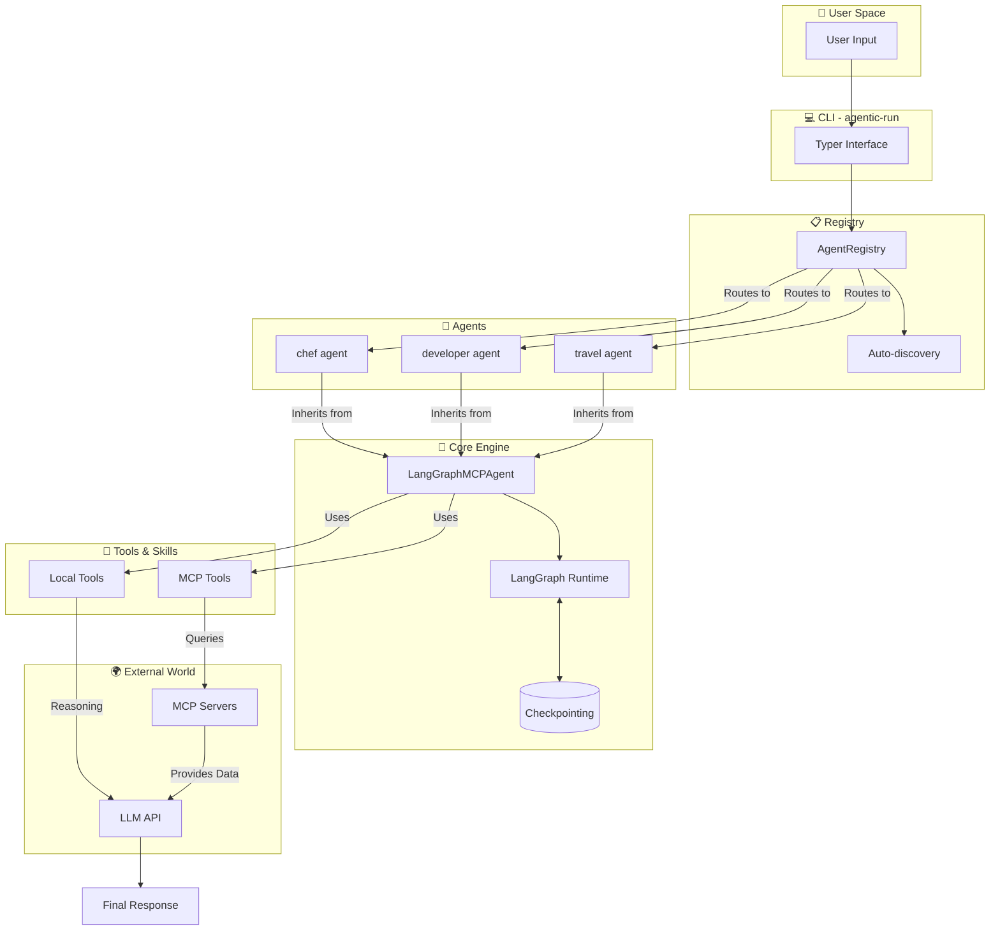

<div align="center">

# 🤖 Agentic Framework
**Build AI agents that *actually* do things.**

[](https://python.org)
[](https://python.langchain.com/)
[](https://modelcontextprotocol.io/)
[](https://www.docker.com/)
[](LICENSE)
[](https://github.com/jeancsil/agentic-framework/actions)
[](https://github.com/jeancsil/agentic-framework)

<br>

Combine **local tools** and **MCP servers** in a single, elegant runtime.  
Write agents in **5 lines of code**. Run them anywhere.

</div>

---

## 💡 Why Agentic Framework?

Instead of spending days wiring together LLMs, tools, and execution environments, Agentic Framework gives you a production-ready setup instantly.

*   **Write Less, Do More:** Create a fully functional agent with just 5 lines of Python using the zero-config `@AgentRegistry.register` decorator.
*   **Context is King (MCP):** Native integration with Model Context Protocol (MCP) servers to give your agents live data (Web search, APIs, internal databases).
*   **Hardcore Local Tools:** Built-in blazing fast tools (`ripgrep`, `fd`, AST parsing) so your agents can explore and understand local codebases out-of-the-box.
*   **Stateful & Resilient:** Powered by **LangGraph** to support memory, cyclic reasoning, and human-in-the-loop workflows.
*   **Docker-First Isolation:** Every agent runs in isolated containers—no more "it works on my machine" when sharing with your team.

---

## 🎬 See it in Action

> *In this single command, the framework orchestrates 3 distinct AI sub-agents working together to plan a trip—built entirely in just **126 lines of Python**.*

<p align="center">
  
</p>

---

## 📑 Table of Contents
- [🧰 Available Out of the Box](#-available-out-of-the-box)
  - [🤖 Agents](#-agents)
  - [📦 Local Tools (Zero External Dependencies)](#-local-tools-zero-external-dependencies)
  - [🌐 MCP Servers (Context Superpowers)](#-mcp-servers-context-superpowers)
- [🚀 Quick Start (Zero to Agent in 60s)](#-quick-start-zero-to-agent-in-60s)
- [🛠️ Build Your Own Agent](#️-build-your-own-agent)
- [🏗️ Architecture](#️-architecture)
- [💻 CLI Reference](#-cli-reference)
- [🧑‍💻 Local Development](#local-development)
- [🎬 See it in Action](#-see-it-in-action)
- [🤝 Contributing](#-contributing)

---

## 🧰 Available Out of the Box

### 🤖 Agents

| Agent | Purpose | MCP Servers | Local Tools |
|-------|---------|-------------|-------------|
| `developer` | **Code Master:** Read, search & edit code. | `webfetch` | *All codebase tools below* |
| `travel-coordinator` | **Trip Planner:** Orchestrates agents. | `kiwi-com-flight-search`<br>`webfetch` | *Uses 3 sub-agents* |
| `chef` | **Chef:** Recipes from your fridge. | `webfetch` | - |
| `news` | **News Anchor:** Aggregates top stories. | `webfetch` | - |
| `travel` | **Flight Booker:** Finds the best routes. | `kiwi-com-flight-search` | - |
| `simple` | **Chat Buddy:** Vanilla conversational agent. | - | - |

### 📦 Local Tools (Zero External Dependencies)

| Tool | Capability | Example |
|------|------------|---------|
| `find_files` | Fast search via `fd` | `*.py` finds Python files |
| `discover_structure` | Directory tree mapping | Understands project layout |
| `get_file_outline` | AST signature parsing (Python, TS, Go, Rust, Java, C++, PHP) | Extracts classes/functions |
| `read_file_fragment` | Precise file reading | `file.py:10:50` |
| `code_search` | Fast search via `ripgrep` | Global regex search |
| `edit_file` | Safe file editing | Inserts/Replaces lines |

<details>
<summary><strong>📝 Advanced: <code>edit_file</code> Formats</strong></summary>

**RECOMMENDED: `search_replace` (no line numbers needed)**
```json
{"op": "search_replace", "path": "file.py", "old": "exact text", "new": "replacement text"}
```

**Line-based operations:**
`replace:path:start:end:content` | `insert:path:after_line:content` | `delete:path:start:end`

</details>

### 🌐 MCP Servers (Context Superpowers)

| Server | Purpose | API Key Needed? |
|--------|---------|-----------------|
| `kiwi-com-flight-search` | Search real-time flights | 🟢 No |
| `webfetch` | Extract clean text from URLs & web search | 🟢 No |

---

## 🚀 Quick Start (Zero to Agent in 60s)

### 1. Add your Brain (API Key)
You need an **LLM API key** (OpenAI or Anthropic) to breathe life into your agents. The framework uses Langchain under the hood, so standard environment functions perfectly!

```bash
# Copy the template
cp .env.example .env

# Edit .env and paste your API key
# OPENAI_API_KEY=sk-your-key-here
# ANTHROPIC_API_KEY=sk-ant-your-key-here
```
> ⚠️ **Note:** At minimum, set your preferred provider's API key. Without it, your agents will sleep forever! 💤

### 2. Build & Run
No `pip`, no `virtualenv`, no *"it works on my machine"* excuses.

```bash
# Clone the repository
git clone https://github.com/jeancsil/agentic-framework.git
cd agentic-framework

# Build the Docker image
make docker-build

# Unleash your first agent!
bin/agent.sh developer -i "Explain this codebase"

# Or try the chef agent
bin/agent.sh chef -i "I have chicken, rice, and soy sauce. What can I make?"
```

<details>
<summary><strong>🔑 Required Environment Variables</strong></summary>

| Variable | Required? | Description |
|----------|-----------|-------------|
| `OPENAI_API_KEY` | 🟢 **Yes*** | OpenAI API key (*if using OpenAI) |
| `ANTHROPIC_API_KEY`| 🟢 **Yes*** | Anthropic API key (*if using Anthropic) |
| `OPENAI_MODEL_NAME` | ⚪ No | Model to use (default: `gpt-4o`/`gpt-4`) |

</details>

---

## 🛠️ Build Your Own Agent

### The 5-Line Superhero 🦸‍♂️

```python
from agentic_framework.core.langgraph_agent import LangGraphMCPAgent
from agentic_framework.registry import AgentRegistry

@AgentRegistry.register("my-agent", mcp_servers=["webfetch"])
class MyAgent(LangGraphMCPAgent):
    @property
    def system_prompt(self) -> str:
        return "You are my custom agent with the power to fetch websites."
```

Boom. Run it instantly:
```bash
bin/agent.sh my-agent -i "Summarize https://example.com"
```

### Advanced: Custom Local Tools 🔧

Want to add your own Python logic? Easy.

```python
from langchain_core.tools import StructuredTool
from agentic_framework.core.langgraph_agent import LangGraphMCPAgent
from agentic_framework.registry import AgentRegistry

@AgentRegistry.register("data-processor")
class DataProcessorAgent(LangGraphMCPAgent):
    @property
    def system_prompt(self) -> str:
        return "You process data files like a boss."

    def local_tools(self) -> list:
        return [
            StructuredTool.from_function(
                func=self.process_csv,
                name="process_csv",
                description="Process a CSV file path",
            )
        ]

    def process_csv(self, filepath: str) -> str:
        # Magic happens here ✨
        return f"Successfully processed {filepath}!"
```

---

## 🏗️ Architecture

Under the hood, we seamlessly bridge the gap between user intent and execution:



---

## 💻 CLI Reference

Command your agents directly from the terminal.

```bash
# 📋 List all registered agents
bin/agent.sh list

# 🕵️ Get detailed info about what an agent can do
bin/agent.sh info developer

# 🚀 Run an agent with input
bin/agent.sh developer -i "Analyze the architecture of this project"

# ⏱️ Run with an execution timeout (seconds)
bin/agent.sh developer -i "Refactor this module" -t 120

# 📝 Run with debug-level verbosity
bin/agent.sh developer -i "Hello" -v

# 📜 Access logs (same location as local)
tail -f agentic-framework/logs/agent.log
```

---

<a id="local-development"></a>
## 🧑‍💻 Local Development

Prefer running without Docker? We got you.

<details>
<summary><strong>System Requirements & Setup</strong></summary>

**Requirements:**
- Python 3.12+
- `ripgrep`, `fd`, `fzf`

```bash
# Install dependencies (blazingly fast with uv ⚡)
make install

# Run the test suite
make test

# Run agents directly in your environment
uv --directory agentic-framework run agentic-run developer -i "Hello"
```
</details>

<details>
<summary><strong>Useful `make` Commands</strong></summary>

```bash
make install    # Install dependencies with uv
make test       # Run pytest with coverage
make format     # Auto-format codebase with ruff
make check      # Strict linting (mypy + ruff)
```
</details>

---

## 🤝 Contributing

We love contributions! Check out our [AGENTS.md](AGENTS.md) for development guidelines.

**The Golden Rules:**
1. `make check` should pass without complaints.
2. `make test` should stay green.
3. Don't drop test coverage (we like our 80% mark!).

---

## 📄 License

This project is licensed under the **MIT License**. See [LICENSE](LICENSE) for details.

---

<p align="center">
  <strong>Stand on the shoulders of giants:</strong><br><br>
  <a href="https://python.langchain.com/"></a>
  <a href="https://modelcontextprotocol.io/"></a>
  <a href="https://github.com/langchain-ai/langgraph"></a>
</p>

<p align="center">
  If you find this useful, please consider giving it a ⭐!<br><br>
  <a href="https://github.com/jeancsil/agentic-framework/stargazers">
    
  </a>
</p>
