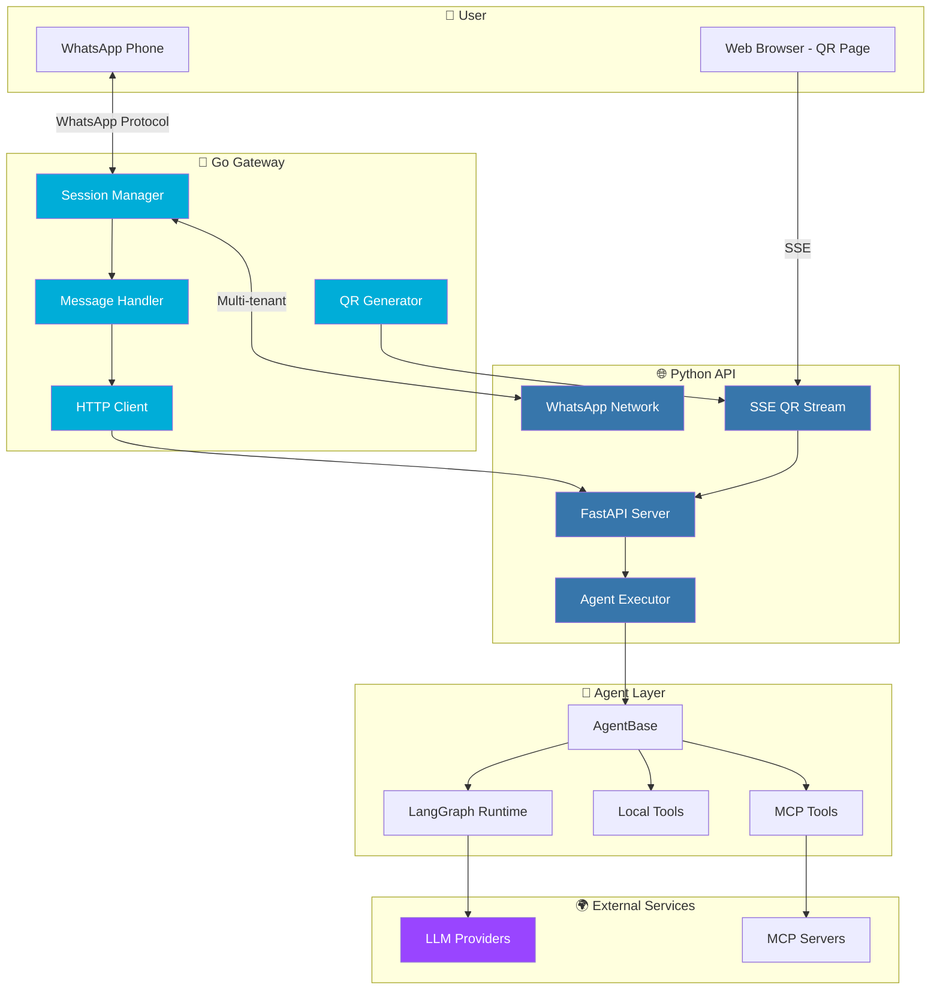

<div align="center">

# 🎩 Agntrick
**Multi-tenant WhatsApp AI platform.**

[](https://python.org)
[](https://python.langchain.com/)
[](https://modelcontextprotocol.io/)
[](LICENSE)
[](https://github.com/jeancsil/agntrick/actions)
[](https://github.com/jeancsil/agntrick)

<br>

**Production-ready WhatsApp integration** with Go gateway reliability and Python agent flexibility.

Connect multiple WhatsApp numbers, deploy AI agents, and scale effortlessly.

</div>

---

## 💡 Why Agntrick?

**Enterprise WhatsApp Integration**

- **Multi-tenant by design**: Support multiple WhatsApp accounts (phone numbers) in a single deployment
- **Go gateway reliability**: Built on whatsmeow with robust session management, LID-based JID support, and async event handling
- **Python agent flexibility**: LangGraph-powered agents with 10+ LLM provider support
- **Production features**: Persistent typing indicators, progress logging, session recovery

**Developer Experience**

- **5-line agents**: Create custom agents with `@AgentRegistry.register` decorator
- **MCP native**: Model Context Protocol servers for live data access
- **Flexible deployment**: Docker or bare metal (ideal for resource-constrained servers)
- **Type-safe**: Full type hints with strict mypy checking

---

## 🚀 Quick Start

### Option 1: Docker

```bash
# Clone the repository
git clone https://github.com/jeancsil/agntrick.git
cd agntrick

# Start the platform
docker compose up -d

# View logs
tail -f logs/whatsapp.log
```

### Option 2: Bare Metal (Local Development)

**Requirements:**
- Go 1.21+
- Python 3.12+
- `uv` package manager

```bash
# Install Python dependencies
uv sync

# Build Go gateway
make gateway-build

# Start Python API
agntrick serve

# In another terminal, start Go gateway
cd gateway && go run .
```

### Authenticate with WhatsApp

1. Open the QR code page: `http://localhost:8000/api/v1/whatsapp/qr/personal/page`
2. Scan with WhatsApp (Settings > Linked Devices)
3. Send yourself a message to test

### Option 3: pip install

```bash
pip install agntrick
agntrick init   # Interactive setup wizard
```

The init wizard walks you through everything:

```
╭─────────────────── Agntrick Setup ───────────────────╮
│ Welcome to Agntrick!                                 │
│ This wizard will set up your configuration.          │
│ Press Enter to accept defaults shown in brackets.    │
╰──────────────────────────────────────────────────────╯

 LLM provider (z.ai, openai, anthropic, google, ollama, openrouter) [z.ai]: openai
 Model name [gpt-4o-mini]:
 Temperature (0.0 = deterministic, 1.0 = creative) [0.1]:
 API key (will be written to .env): sk-••••••••••••
 Write credentials to .env? [Y/n]: Y
 Wrote OPENAI_API_KEY to .env

 Set up WhatsApp integration? (requires Go gateway binary) [y/N]: y
 Tenant ID (a short name, e.g. 'personal') [personal]:
 WhatsApp phone number (international format, e.g. +5511999999999): +5511999999999
 Default agent (assistant, developer, learning, news) [assistant]:

 Config written to ~/.agntrick.yaml
```

Then start chatting:

```bash
agntrick list                    # list available agents
agntrick chat "Hello!"           # chat with the assistant
```

#### WhatsApp Gateway (optional)

Download the pre-built binary for your platform from [GitHub Releases](https://github.com/jeancsil/agntrick/releases/latest):

```bash
# Linux (amd64)
curl -L -o agntrick-gateway https://github.com/jeancsil/agntrick/releases/latest/download/agntrick-gateway-linux-amd64
chmod +x agntrick-gateway

# macOS (Apple Silicon)
curl -L -o agntrick-gateway https://github.com/jeancsil/agntrick/releases/latest/download/agntrick-gateway-darwin-arm64
chmod +x agntrick-gateway

# Start both services
agntrick serve                   # Python API on port 8000
./agntrick-gateway               # Go gateway (other terminal)

# Scan the QR code to link your WhatsApp
open http://localhost:8000/api/v1/whatsapp/qr/personal/page
```

---

## ⚙️ Configuration

Create `.agntrick.yaml`:

```yaml
llm:
  provider: anthropic  # or openai, google, ollama, etc.
  model: claude-sonnet-4-6
  temperature: 0.7

api:
  host: 127.0.0.1
  port: 8000

storage:
  base_path: ~/.local/share/agntrick

logging:
  level: INFO
  api_log: logs/api.log
  whatsapp_log: logs/whatsapp.log

auth:
  api_keys:
    "your-api-key": "admin"

whatsapp:
  tenants:
    - id: personal
      phone: "+34999888777"
      default_agent: developer
      allowed_contacts: []
    - id: work
      phone: "+15551234567"
      default_agent: assistant
      allowed_contacts:
        - "+15559876543"
```

**Configuration Options:**

| Option | Description |
|--------|-------------|
| `whatsapp.tenants` | List of WhatsApp accounts to manage |
| `tenants[].id` | Unique tenant identifier |
| `tenants[].phone` | Phone number in E.164 format |
| `tenants[].default_agent` | Agent to use for messages from this tenant |
| `tenants[].allowed_contacts` | Optional whitelist (empty = all contacts) |
| `auth.api_keys` | API keys for gateway-to-API communication |

---

## 🛠️ Create Custom Agents

### The 5-Line Agent

```python
from agntrick import AgentBase, AgentRegistry

@AgentRegistry.register("my-assistant", mcp_servers=["fetch"])
class MyAssistant(AgentBase):
    @property
    def system_prompt(self) -> str:
        return "You are a helpful assistant with web search access."
```

Deploy instantly — messages from your configured WhatsApp numbers will route to your agent.

### Advanced: Custom Tools

```python
from langchain_core.tools import StructuredTool
from agntrick import AgentBase, AgentRegistry

@AgentRegistry.register("data-analyst")
class DataAnalyst(AgentBase):
    @property
    def system_prompt(self) -> str:
        return "You analyze CSV files and generate insights."

    def local_tools(self) -> list:
        return [
            StructuredTool.from_function(
                func=self.analyze_csv,
                name="analyze_csv",
                description="Analyze a CSV file and return statistics",
            )
        ]

    def analyze_csv(self, filepath: str) -> str:
        # Your analysis logic
        return f"Analyzed {filepath}: found 1000 rows, 5 columns"
```

---

## 🏗️ Architecture

### Multi-Tenant Platform


```mermaid
flowchart TB
    subgraph User [👤 User]
        Phone[WhatsApp Phone]
        Browser[Web Browser - QR Page]
    end

    subgraph Gateway [🚪 Go Gateway]
        SM[Session Manager]
        MH[Message Handler]
        QG[QR Generator]
        HC[HTTP Client]
    end

    subgraph API [🌐 Python API]
        FE[FastAPI Server]
        WA[WhatsApp Routes]
        AE[Agent Executor]
        QR[SSE QR Stream]
    end

    subgraph Agents [🤖 Agent Layer]
        AB[AgentBase]
        LG[LangGraph Runtime]
        LT[Local Tools]
        MT[MCP Tools]
    end

    subgraph External [🌍 External Services]
        LLM[LLM Providers]
        MCP[MCP Servers]
        WA[WhatsApp Network]
    end

    Phone <-->|WhatsApp Protocol| SM
    SM --> MH
    MH --> HC
    HC --> FE

    Browser -->|SSE| QR
    QG --> QR
    QR --> FE

    FE --> AE
    AE --> AB
    AB --> LG
    AB --> LT
    AB --> MT

    LG --> LLM
    MT --> MCP

    SM <-->|Multi-tenant| WA

    classDef whatsapp fill:#25D366,color:#fff
    classDef go fill:#00ADD8,color:#fff
    classDef python fill:#3776AB,color:#fff
    classDef llm fill:#9945FF,color:#fff

    class WA whatsapp
    class SM,MH,QG,HC go
    class FE,WA,AE,QR python
    class LLM llm
```

### Component Overview

**Go Gateway** (`gateway/`):
- **Multi-tenant**: Manage multiple WhatsApp accounts simultaneously
- **Session persistence**: Sessions survive restarts via device reuse
- **LID-based JID support**: Handles WhatsApp's Linked Identity Device format
- **Async event handling**: Long LLM calls don't block message processing
- **Typing indicator persistence**: Re-sends every 3s during LLM responses
- **Progress logging**: INFO-level updates during long operations

**Python API** (`src/agntrick/api/`):
- **FastAPI server**: RESTful endpoints for agent execution
- **WhatsApp webhooks**: Receive messages from Go gateway
- **QR code streaming**: SSE for real-time QR code delivery
- **Tenant isolation**: Separate agent instances per tenant
- **API key auth**: Secure gateway-to-API communication

**Agent Framework** (`src/agntrick/`):
- **AgentBase**: LangGraph-powered base class with built-in tool management
- **AgentRegistry**: Decorator-based registration with auto-discovery
- **MCP integration**: Native Model Context Protocol support
- **10+ LLM providers**: Anthropic, OpenAI, Google, Mistral, Ollama, etc.

---

## 🧰 Available Integrations

### Local Tools

Fast, zero-dependency tools for your agents:

| Tool | Capability |
|------|------------|
| `find_files` | Fast file search via `fd` |
| `discover_structure` | Directory tree mapping |
| `get_file_outline` | AST signature parsing |
| `read_file_fragment` | Precise file reading |
| `code_search` | Fast code search via `ripgrep` |
| `edit_file` | Safe file editing |

### MCP Servers

Extend your agents with Model Context Protocol servers:

| Server | Purpose |
|--------|---------|
| `fetch` | Extract clean text from URLs |
| `web-forager` | Web search and content fetching |
| `kiwi-com-flight-search` | Real-time flight search |

### LLM Providers

Support for 10+ providers covering 90%+ of the market:

| Provider | Type | Use Case |
|----------|------|----------|
| **Anthropic** | Cloud | State-of-the-art reasoning (Claude) |
| **OpenAI** | Cloud | GPT-4, GPT-4.1, o1 series |
| **Azure OpenAI** | Cloud | Enterprise OpenAI deployments |
| **Google GenAI** | Cloud | Gemini models via API |
| **Google Vertex AI** | Cloud | Gemini models via GCP |
| **Mistral AI** | Cloud | European privacy-focused models |
| **Cohere** | Cloud | Enterprise RAG and Command models |
| **AWS Bedrock** | Cloud | Anthropic, Titan, Meta via AWS |
| **Ollama** | Local | Run LLMs locally (zero API cost) |
| **Hugging Face** | Cloud | Open models from Hugging Face Hub |

---

## 💻 CLI Reference

```bash
# Start the platform (Python API)
agntrick serve

# Start with custom config
agntrick serve --config .agntrick.yaml

# Start with custom host/port
agntrick serve --host 0.0.0.0 --port 8080

# Enable debug logging
agntrick serve --log-level DEBUG

# Check API health
curl http://localhost:8000/health

# View API logs
tail -f logs/api.log

# View gateway logs
tail -f logs/whatsapp.log
```

### API Endpoints

| Method | Endpoint | Description |
|--------|----------|-------------|
| `GET` | `/health` | Health check |
| `GET` | `/ready` | Readiness check |
| `GET` | `/api/v1/whatsapp/qr/{tenant_id}` | SSE QR code stream |
| `GET` | `/api/v1/whatsapp/qr/{tenant_id}/page` | HTML QR code viewer |
| `POST` | `/api/v1/whatsapp/qr/{tenant_id}` | Receive QR from gateway |
| `POST` | `/api/v1/whatsapp/status/{tenant_id}` | Connection status update |
| `POST` | `/api/v1/channels/whatsapp/message` | Incoming message webhook |

---

## 🐳 Deployment Options

### Option 1: Docker

Best for development environments and teams wanting consistent, isolated deployments.

```bash
# Build the image
make docker-build

# Start all services
docker compose up -d

# View logs
docker compose logs -f

# Stop services
docker compose down
```

**Docker Benefits:**

- **Memory efficient**: Limited to 512MB
- **Health checks**: Built-in monitoring endpoints
- **Isolated environment**: Consistent across deployments
- **Multi-stage build**: Optimized Go gateway + Python API

### Option 2: Bare Metal

Best for low-memory VPS (recommended for production on resource-constrained servers like Digital Ocean droplets).

```bash
# Install dependencies
uv sync
make gateway-build

# Start Python API
agntrick serve

# In another terminal, start Go gateway
cd gateway && go run .
```

**Bare Metal Benefits:**

- **Lower memory footprint**: No Docker overhead (~100-200MB saved)
- **Direct process management**: Fine-grained control with systemd or supervisord
- **Faster startup**: No container initialization
- **Easier debugging**: Direct access to logs and processes

---

## 🧑‍💻 Development

```bash
# Install dependencies
make install

# Run tests
make test

# Run linting
make check

# Format code
make format

# Build packages
make build
```

---

## 📄 License

This project is licensed under the **MIT License**. See [LICENSE](LICENSE) for details.

---

<p align="center">
  <strong>Built with:</strong><br>
  <a href="https://python.langchain.com/"></a>
  <a href="https://modelcontextprotocol.io/"></a>
  <a href="https://github.com/langchain-ai/langgraph"></a>
  <a href="https://go.dev/"></a>
</p>

<p align="center">
  If you find this useful, please consider giving it a ⭐<br>
  <a href="https://github.com/jeancsil/agntrick/stargazers">
    
  </a>
</p>
