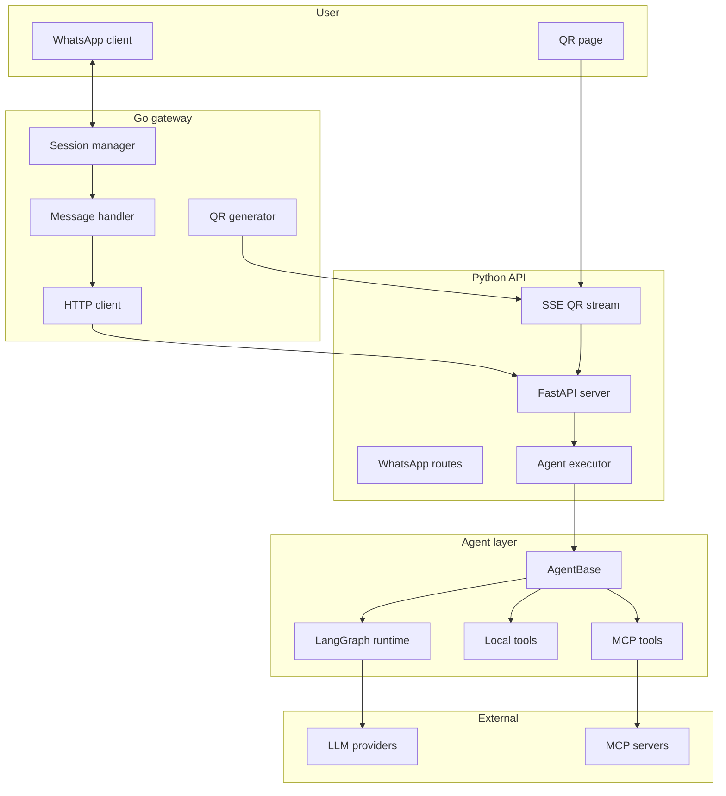

# Architecture

Agntrick is a multi-tenant WhatsApp AI platform. Two processes do the heavy lifting:

- **Go gateway** (`gateway/`) — owns the WhatsApp protocol via `whatsmeow`. Multi-tenant session manager, QR onboarding, message delivery.
- **Python API** (`src/agntrick/`) — FastAPI server hosting LangGraph-based agents, MCP integrations, and the persistence layer.

The gateway speaks HTTP to the API. They are deployed and scaled independently.

## Component map

## Execution flow

The graph and pipeline are documented in detail in [`CLAUDE.md`](../CLAUDE.md#execution-flow). Quick summary:

1. **Entry** — message arrives via gateway HTTP webhook, CLI (`agntrick chat`), or direct API.
2. **Initialization** — agent registry resolves the agent class; first invocation lazily fetches the tool manifest and connects MCP servers (sequential, intentional).
3. **Graph execution** — three nodes: Summarize (token-budget compression) → Router (LLM intent classifier) → Agent (tool calls + response formatting).
4. **Output** — formatted for WhatsApp (~1500 char chunking, link sanitization).

## Key design decisions

- **Multi-tenant by default** — every request is scoped by `tenant_id`. The pool (`api/pool.py`) keeps one warm agent instance per tenant with LRU eviction.
- **Sub-agent delegation** — agents can invoke other agents via the `agent_invocation` tool. Each delegation runs in its own thread with a fresh event loop (necessary for anyio's MCP context cleanup).
- **Pre-routing** — the router classifies intent (chat / tool_use / research / delegate) and selects the cheapest path. `tool_use` skips the sub-agent and calls a tool directly with one LLM call for response shaping.

## Deeper reading

- Execution flow with timing budgets and blocking calls — [`CLAUDE.md`](../CLAUDE.md)
- Agent registration patterns — [`docs/agents.md`](agents.md)
- LLM provider abstraction — [`docs/llm-providers.md`](llm-providers.md)
- MCP integration — [`docs/mcp-servers.md`](mcp-servers.md)
- HTTP API reference — [`docs/api.md`](api.md)
