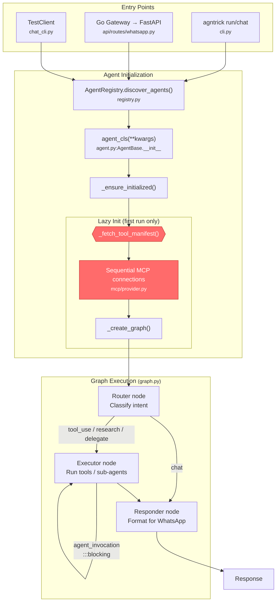
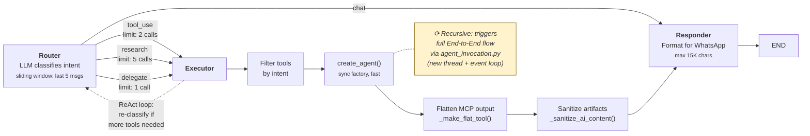

# Architecture Diagrams Implementation Plan

> **For agentic workers:** REQUIRED SUB-SKILL: Use superpowers:subagent-driven-development (recommended) or superpowers:executing-plans to implement this plan task-by-task. Steps use checkbox (`- [ ]`) syntax for tracking.

**Goal:** Add Mermaid execution-flow diagrams and a blocking-calls audit to AGENTS.md so that any agent (or human) can understand the control flow at a glance.

**Architecture:** Two Mermaid diagrams replace the existing "Key Architecture Concepts" section. A blocking-calls table is added below the diagrams. A behavioral rule is appended to the existing "Behavioral Rules" section.

**Tech Stack:** Markdown, Mermaid syntax (flowchart TD/LR)

---

### Task 1: Replace "Key Architecture Concepts" with End-to-End Diagram

**Files:**
- Modify: `AGENTS.md:188-217` (replace the "## Key Architecture Concepts" section including its subsections "### Intent Routing", "### Agent Registration", "### Tool Manifest", "### MCP Server Manager")

- [ ] **Step 1: Edit AGENTS.md — replace the entire "Key Architecture Concepts" section**

Replace everything from the line `## Key Architecture Concepts` up to (but not including) `---` (the separator before `## Code Standards`) with the following content:

```markdown
## Execution Flow

### End-to-End Pipeline



### Graph Detail (3-Node StateGraph)



### Blocking Calls

| Location | Pattern | Impact | Intentional? |
|---|---|---|---|
| `tools/agent_invocation.py:136-138` | `thread.join()` + new event loop | Blocks up to 65s on delegation | Necessary — each delegated agent needs isolated loop |
| `mcp/provider.py:122-127` | Sequential `await stack.enter_async_context()` | N × 60s startup delay | Yes — avoids anyio "different task" cleanup bugs |
| `graph.py:434` | `create_agent()` sync factory | Negligible (in-memory) | Yes |
| `agent.py:266-294` | `_fetch_tool_manifest()` HTTP | 5s+ if toolbox slow | Circuit breaker + 5m cache mitigates |

### Agent Registration

```python
@AgentRegistry.register("agent-name", mcp_servers=["toolbox"], tool_categories=["web"])
class MyAgent(AgentBase):
    @property
    def system_prompt(self) -> str:
        return load_prompt("agent-name")  # loads from prompts/agent-name.md

    def local_tools(self) -> Sequence[Any]:
        return [...]  # optional local tools
```

### Tool Manifest

`tools/manifest.py` discovers available tools from the toolbox MCP server with a circuit breaker for resilience. The `assistant` agent uses `tool_categories` to filter which toolbox tools it accesses.

### MCP Server Manager

`chat_cli.py:MCPServerManager` handles the agntrick-toolkit subprocess lifecycle. Set `AGNTRICK_TOOLKIT_PATH` to auto-start the toolkit when using `agntrick chat` or `agntrick serve`.
```

- [ ] **Step 2: Verify Mermaid syntax renders correctly**

Open `AGENTS.md` in a Markdown preview that supports Mermaid (VS Code with Mermaid plugin, GitHub, or mermaid.live) and verify:
- Diagram 1 renders with three subgraphs (Entry, Init, Exec), red `blocking` nodes, and correct arrow labels
- Diagram 2 renders with Router → conditional branches → Executor sub-steps → Responder → END, dotted feedback loop from Executor back to Router, and the recursive note

- [ ] **Step 3: Verify no lint/test breakage**

Run: `make check && make test`
Expected: PASS (AGENTS.md changes don't affect Python code)

- [ ] **Step 4: Commit**

```bash
git add AGENTS.md
git commit -m "docs: add execution flow Mermaid diagrams to AGENTS.md"
```

---

### Task 2: Add Behavioral Rule to AGENTS.md

**Files:**
- Modify: `AGENTS.md` — append to the "## Behavioral Rules" section (currently lines 276-284)

- [ ] **Step 1: Edit the Behavioral Rules section**

Add this line after the existing `- **Before** refactoring, ensure tests cover affected code` line (the last behavioral rule):

```markdown
- **When modifying** `agent.py`, `graph.py`, `mcp/provider.py`, `tools/manifest.py`, `api/routes/`, or `whatsapp/webhook.py`: verify the "Execution Flow" Mermaid diagrams still reflect the current code
```

- [ ] **Step 2: Verify the rule is in the right section**

Read the modified section and confirm it appears as the last bullet under "## Behavioral Rules", after the existing `refactoring` rule.

- [ ] **Step 3: Verify no lint/test breakage**

Run: `make check && make test`
Expected: PASS

- [ ] **Step 4: Commit**

```bash
git add AGENTS.md
git commit -m "docs: add diagram-sync behavioral rule to AGENTS.md"
```

---

### Task 3: Final Verification

- [ ] **Step 1: Run full check**

Run: `make check && make test`
Expected: PASS

- [ ] **Step 2: Verify diagram accuracy against source**

Read each file referenced in the diagrams and confirm the node labels match the actual code:

| Diagram node | Source file | Verify |
|---|---|---|
| `AgentRegistry.discover_agents()` | `registry.py` | Function exists |
| `_ensure_initialized()` | `agent.py:296` | Method exists at that line |
| `_fetch_tool_manifest()` | `agent.py:266` | Method exists at that line |
| `Sequential MCP connections` | `mcp/provider.py:122` | `for name in self._config` loop |
| `Router node` | `graph.py:327` | `router_node` function |
| `Executor node` | `graph.py:355` | `executor_node` function |
| `Responder node` | `graph.py:498` | `responder_node` function |
| `thread.join()` | `tools/agent_invocation.py:138` | Blocking call exists |
| `create_agent()` | `graph.py:434` | Sync factory call |
| `_make_flat_tool()` | `graph.py:269` | Function exists |
| `_sanitize_ai_content()` | `graph.py:57` | Function exists |

- [ ] **Step 3: Commit spec file**

```bash
git add docs/superpowers/specs/2026-04-07-architecture-diagrams-design.md
git commit -m "docs: add architecture diagrams design spec"
```
